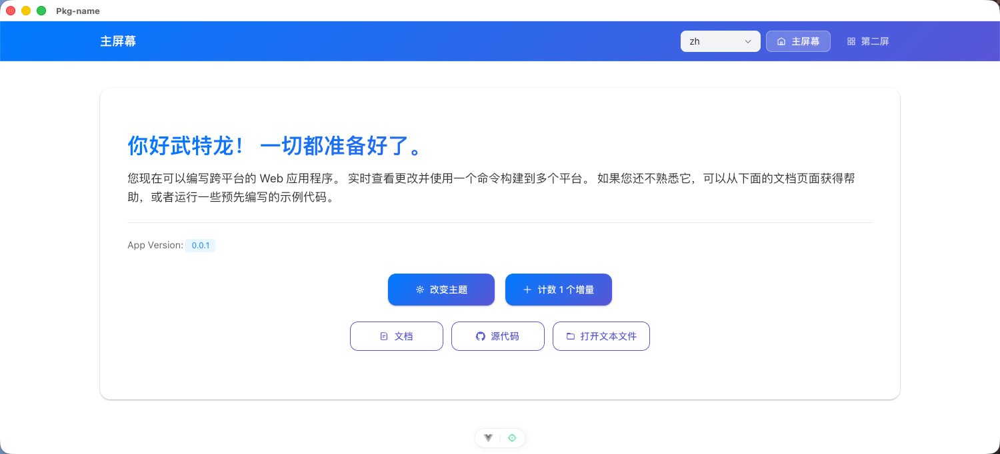

# Vutron - 现代化 Electron + Vue 3 应用模板

[](https://nodejs.org/)
[](https://vuejs.org/)
[](https://electronjs.org/)
[](https://www.typescriptlang.org/)
[](https://vitejs.dev/)
[](https://arco.design/)

Vutron 是一个现代化的跨平台桌面应用程序开发模板，基于 Electron、Vue 3、TypeScript 和 Vite 构建。它提供了开箱即用的开发环境，让您可以快速构建高质量的桌面应用程序。



## ✨ 特性

- 🚀 **现代化技术栈**：使用 Vue 3 Composition API、TypeScript 和 Vite
- 🎨 **优雅的 UI**：集成 Arco Design Vue 组件库，支持亮色/暗色主题
- 🌐 **国际化支持**：内置 i18n 支持，已包含中文简体、繁体和英文语言包
- 🖥️ **跨平台支持**：支持 Windows、macOS 和 Linux
- 📦 **打包构建**：使用 electron-builder，支持多平台打包
- 🔧 **开发体验**：热重载、调试工具、ESLint 代码规范
- 🎯 **最佳实践**：遵循 Vue 3 和 TypeScript 最佳实践
- 🪟 **托盘支持**：可选的系统托盘功能
- 📝 **日志系统**：集成 electron-log，支持文件和控制台日志

## 📋 系统要求

- Node.js >= 20.0.0
- pnpm >= 7.0.0（推荐）

## 🚀 快速开始

### 安装依赖

```bash
pnpm install
```

### 开发模式

```bash
pnpm dev
```

### 构建应用

```bash
# 构建所有平台
pnpm build:all

# 构建特定平台
pnpm build:mac     # macOS
pnpm build:win     # Windows
pnpm build:linux   # Linux
```

## 📁 项目结构

```
src/
├── main/                 # 主进程代码
│   ├── index.ts          # 主进程入口
│   ├── MainRunner.ts     # 主窗口创建和管理
│   ├── IPCs.ts           # IPC 通信处理
│   ├── tray.ts           # 系统托盘功能
│   └── utils/            # 主进程工具函数
├── preload/              # 预加载脚本
│   └── index.ts          # 预加载脚本入口
└── renderer/             # 渲染进程代码
    ├── App.vue           # 根组件
    ├── main.ts           # 渲染进程入口
    ├── components/       # Vue 组件
    │   └── layout/       # 布局组件
    ├── composables/      # Vue 组合式函数
    ├── locales/          # 国际化语言包
    ├── plugins/          # 插件配置
    ├── screens/          # 页面组件
    ├── store/            # Pinia 状态管理
    └── styles/           # 样式文件
```

## 🛠️ 开发指南

### 主进程

主进程位于 `src/main/` 目录，负责创建和管理应用窗口、处理系统级操作等。

### 预加载脚本

预加载脚本位于 `src/preload/` 目录，是连接主进程和渲染进程的桥梁。

### 渲染进程

渲染进程位于 `src/renderer/` 目录，是基于 Vue 3 的用户界面代码。

### IPC 通信

项目提供了便捷的 IPC 通信接口，可以在渲染进程中调用主进程的功能：

```typescript
// 在渲染进程中调用主进程方法
const result = await window.mainApi.invoke('methodName', params)
```

### 主题切换

项目内置了亮色/暗色主题切换功能：

```typescript
import { useTheme } from '@/renderer/composables/useTheme'

const { isDarkMode, toggleTheme } = useTheme()

// 切换主题
toggleTheme()
```

### 国际化

项目使用 Vue I18n 进行国际化：

```typescript
import { useI18n } from 'vue-i18n'

const { t } = useI18n()

// 使用翻译
t('menu.change-theme')
```

## 🔧 配置

### 应用配置

应用的基本配置在 `src/main/utils/Constants.ts` 中定义：

```typescript
export const APP_NAME = 'Vutron'
export const APP_VERSION = '0.0.1'
```

### 构建配置

构建配置在 `buildAssets/builder/config.js` 中定义，可以自定义应用名称、图标、打包选项等。

## 📦 打包和分发

项目使用 electron-builder 进行应用打包，支持以下格式：

- **Windows**: `.exe` (NSIS 安装包), `.appx`, `.zip`, 便携版
- **macOS**: `.dmg`, 通用二进制文件 (Intel + Apple Silicon)
- **Linux**: `.deb`, `.rpm`, `.snap`

## 🔗 相关链接

- [官方文档](https://vutron.cdget.com)
- [GitHub 仓库](https://github.com/joey2/vutron)
- [Vue 3 文档](https://vuejs.org/)
- [Electron 文档](https://electronjs.org/)
- [Arco Design Vue](https://arco.design/vue/component/overview)
